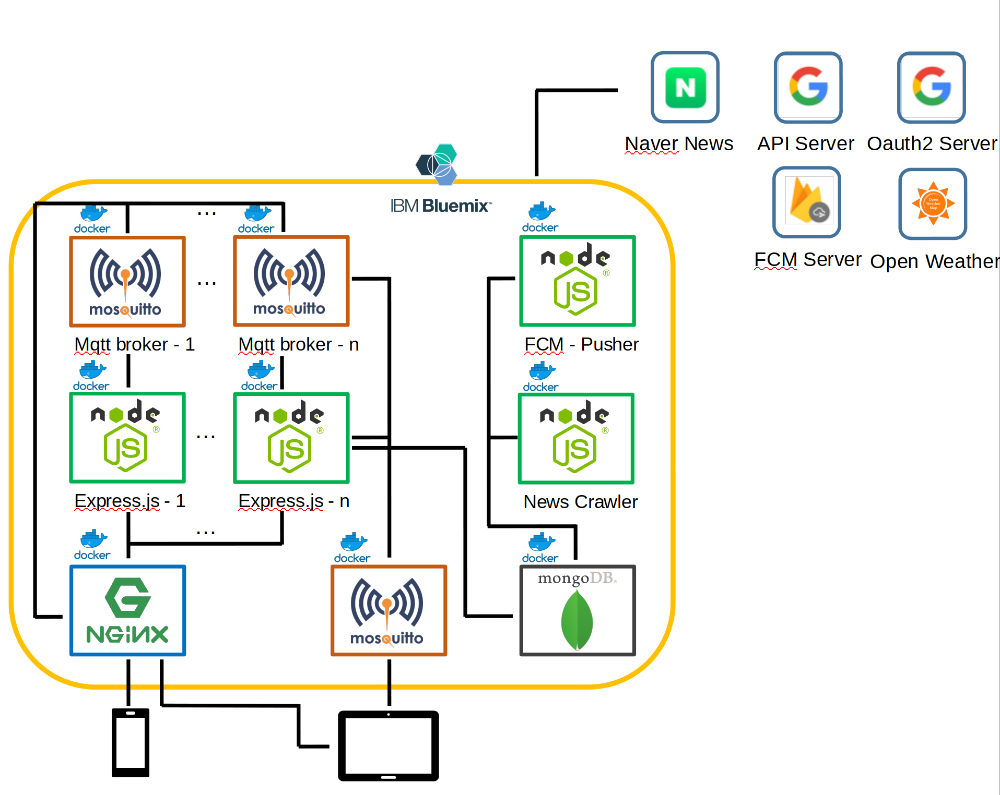

# MagicCalendar : server-release
- URL : http://169.56.98.117
- Application : (private) https://lab.hanium.or.kr/e-display-calendar/android
- Test Application : https://github.com/dfjung4254/E-ink-Display_android-application
- 테스트용 JWT 발급( /debug/webjwt)
  - (로컬테스트) http://localhost/debug/webjwt

</br>

본 레포지토리는
1. 개발환경과 **배포환경**을 통일
2. 원래 개발 중이던 **메인 앱**(Express.js) 외에 **알람 메시지 푸셔**와 **뉴스 크롤러 앱**도 병행 배포
3. **스케일아웃(Scale-out)** 고려

의 목적을 위해 기존 개발중이던 [server-side repository](https://github.com/dfjung4254/E-ink-Display_server-side) 와 [fcm-pusher repository](https://github.com/dfjung4254/E-ink-display_Fcm-pusher) 와 새로운 앱을 합쳐 도커라이징(Dockerizing) 한 배포 환경입니다.

**만약 윈도우에서 Docker 환경에서 개발 및 테스트가 안될 시, 기존 [repo](https://lab.hanium.or.kr/e-display-calendar/server-side) 에서 계속 작업하시고 MergeRequest 주시면 됩니다**

**궁금한거 있으시면 저(근화) 한테 연락주세요**

</br>

## About
**This is for E-ink-display project organized by Hanium**
- **Mento** : 장기숭(IBM Korea)
- **Mentee** : 김지은(Leader, hardware), 정근화(server), 조수빈(server), 류하영(android), 모영보(android)

</br>

## API Specification
#### REST API : [Our API REFERENCE!](http://169.56.98.117) <- apidoc 으로 이전
#### MQTT API : 작업중

</br>

## Server System Map

**Server System Map using docker-compose.yml**</br>
Docker-compose 를 통해 배포된 서버 구조입니다.
</br>

- **REST API 통신 (모바일 -> 서버 -> 모바일)**
  - **Basic** : 모바일(`Android`) --> 웹서버(`Nginx`) --> Express-n(`Nodejs`)
  - **CRUD** : 모바일(`Android`) --> 웹서버(`Nginx`) --> Express-n(`Nodejs`) --> DB(`Mongodb`)
  - **OpenAPI** : 모바일(`Android`) --> 웹서버(`Nginx`) --> Express-n(`Nodejs`) --> 외부API(`OpenWeatherMap`)
  - **API with OAuth2** : 모바일(`Android`) --> 웹서버(`Nginx`) --> Express-n(`Nodejs`) --> DB(`Mongodb`) --> 외부API(`GoogleCalendarAPI`)

- **MQTT 통신 (하드웨어 -> 서버 -> 하드웨어)**
  - **Basic** : 하드웨어(`Raspberry`) --> 웹서버(`Nginx`) --> Mqttbroker-n(`Mosquitto`) --> Express-n(`Nodejs`) --> Mqttbroker0(`Mosquitto`)
  - **CRUD, API** : REST API 통신과 같이 Express-n 에서 처리
  
- **모바일에서 하드웨어 제어 - REST API + MQTT (모바일 -> 서버 -> 하드웨어)**
  - **Basic** : 모바일(`Android`) --> 웹서버(`Nginx`) --> Express-n(`Nodejs`) --> Mqttbroker0(`Mosquitto`)

### External Ports
- **21** : FTP
```
// config 설정 값 옮길 때 사용합니다.
// Github 상에 여러 api 키값이나 config 값을 올릴 수 없기 때문에 ftp로 전송
$ ftp 169.56.98.117
```
- **80** : REST API 호출
```
// cURL 예제
$ curl -X GET \
  'http://169.56.98.117/news?count=20' \
  -H 'Cache-Control: no-cache' \
```
- **443** : REST API 호출(작업예정)
- **1883** : MQTT publish - `요청`
```
// Mosquitto client - publish 요청 예제
$ mosquitto_pub -h 169.56.98.117 \
> -p 1883 \
> -t /server/weather \
> -m "{jwt: exjeO...}"
```
- **1884** : MQTT subscribe - `수신`
```
// Mosquitto client - subscribe 수신 예제
$ mosquitto_sub -h 169.56.98.117 -p 1884 -t /server/weather

{
    날씨정보 반환
}
```

## Developer Guide
### 디렉토리 구조
```
// Lv 3 까지의 디렉토리 구조
$ tree -d -L 3
.
├── References
├── conf
│   └── proxy
│       └── conf.d
├── config
├── containers
│   ├── fcm-pusher
│   │   ├── connect
│   │   ├── model
│   │   ├── node_modules
│   │   └── pusher
│   ├── news-crawler
│   │   ├── connect
│   │   ├── crawler
│   │   ├── model
│   │   └── node_modules
│   └── server-side
│       ├── auth
│       ├── bin
│       ├── connect
│       ├── docs
│       ├── model
│       ├── node_modules
│       ├── public
│       ├── routes
│       ├── routes_mqtt
│       └── utill
└── docker
    └── data
        ├── diagnostic.data
        └── journal

```
- **References** : 구현 중 참고 레퍼런스 보관
- **conf** : Docker 에서 실행하는 컨테이너의 설정 파일 -volume 공유 형식으로 운용
  - proxy : Nginx의 설정 값 저장 폴더
    - conf.d : express.conf, mqtt.conf 파일에서 각 앱의 로드밸런서 설정 값을 정의합니다.
- **config** : 


디렉터리 구조 설명 : config 밑에 config.js, magic_config.json

```

# -d : detached mode
# --force-recreate : recreate
$ docker-compose up --build

```